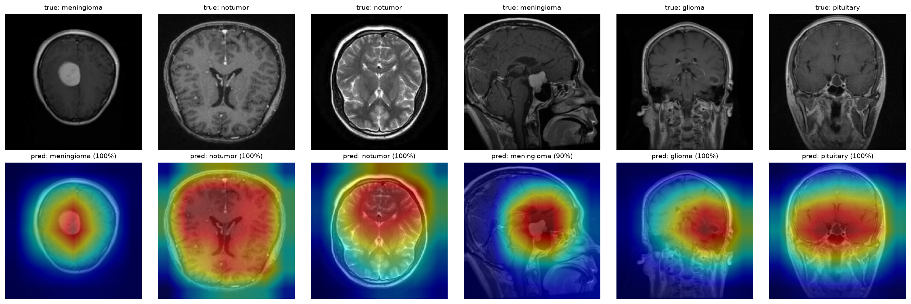
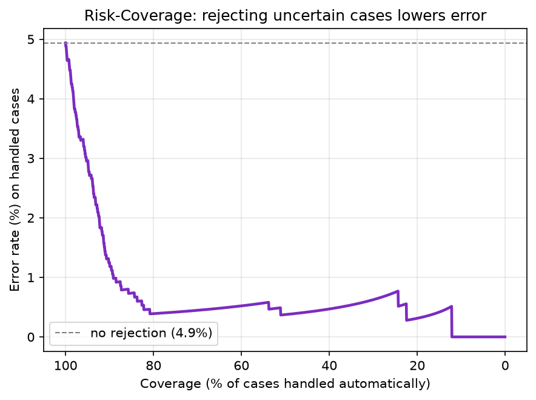

# Brain MRI Classifier with Uncertainty

A brain tumor classifier that doesn't just predict, it knows when it isn't sure.

A model that says "tumor, 95%" isn't much use on its own in medicine. What a
doctor needs to know is **when the model is unsure**, so those cases get a second
look instead of being trusted blindly. This project adds that missing piece: the
model measures its own uncertainty, and the most doubtful scans are flagged for
human review.

Framed as a **triage aid, not a diagnosis tool**.

---

### Where the model looks (Grad-CAM)



The heatmap shows which regions drove the prediction. It localizes focal tumors
(like meningiomas) well. It is more diffuse on infiltrating gliomas and on
no-tumor scans which makes sense, since there is no single spot to point at.

### Rejecting uncertain cases lowers error



Reading it: the x-axis is how many cases the model handles on its own, the y-axis
is the error on those cases. Handing the most uncertain scans to a radiologist
makes the model much more reliable on the ones it keeps.

---

## Quick start

**1. Clone and set up the environment**

```bash
git clone https://github.com/<your-username>/brain-mri-uncertainty.git
cd brain-mri-uncertainty

python -m venv .venv
.venv\Scripts\activate        # Windows
source .venv/bin/activate     # macOS / Linux

pip install -r requirements.txt
```

> **GPU note:** `requirements.txt` installs the CPU build of PyTorch. For GPU
> training, install the CUDA build from [pytorch.org](https://pytorch.org) instead
> (e.g. `pip install torch torchvision --index-url https://download.pytorch.org/whl/cu121`).
> Training on CPU works but is slow.

**2. Get the data**

Read the readme.mdin data folder

**3. Train**

```bash
python src/mriunc/train.py --data data --epochs 15
```

This saves the best model (chosen on validation accuracy) to `results/best_model.pt`.

**4. Reproduce the results**

Run these in order each one prints its numbers and saves its figure to `results/`:

```bash
# does the uncertainty actually mean something?
python src/mriunc/check_uncertainty.py --data data --ckpt results/best_model.pt

# risk-coverage curve
python src/mriunc/rejection.py --data data --ckpt results/best_model.pt

# calibration: is the confidence trustworthy?
python src/mriunc/calibration.py --data data --ckpt results/best_model.pt

# Grad-CAM heatmaps
python src/mriunc/gradcam.py --data data --ckpt results/best_model.pt --n 6
```

**5. (Optional) Compare configurations**

```bash
python src/mriunc/run_experiments.py --data data --epochs 12
mlflow ui --workers 1        # then open http://localhost:5000
```

This trains several configurations (different backbones, dropout rates, frozen vs
fine-tuned encoder, plus a deep ensemble) and logs them all to MLflow so they can
be compared in one table.

---

## How it works a closer look

*This section is for anyone who wants to know what's inside. Skip it if you just
want to run the project.*

### The idea in one paragraph

i saw this methode on a solution during a datathon and i really found it intresting 
So normally, dropout is only used during training: it randomly switches off some
neurons so the network doesn't rely too much on any single one. At prediction
time it's turned off, so the model always gives the same answer for the same
image. **Here we leave dropout ON at prediction time** and run the same image 30
times. Each run switches off different neurons, so we get 30 slightly different
answers. The **average** is the prediction; how much those 30 answers **disagree**
is the uncertainty. On an easy scan the model agrees with itself every time; on a
hard one it wavers. That's the whole trick no extra model, no extra training.
perfect fast applicable solution for descent results :)

### loading the images

Builds the dataloaders and applies three decisions made after looking at the data:

- **Resize to 224x224**, the standard input size for an ImageNet-pretrained encoder.
- **Convert every image to RGB.** The dataset mixes grayscale and RGB images, which
  would break training; converting also matches what the pretrained encoder expects
  (3 channels).
- **Gentle augmentation** on the training set only: horizontal flips, small
  rotations and shifts. No vertical flips or large rotations those would produce
  anatomically impossible brains.

It also splits the data three ways: **train** and **validation** are carved out of
the `Training/` folder, while the official `Testing/` folder is kept untouched and
only used at the very end. Using the test set to tune anything would inflate the
final numbers.

### the classifier (model.py)

A **pretrained ResNet encoder** with the ImageNet classifier removed, plus a small
head with two dropout layers for the 4 classes. Transfer learning: the encoder
already knows edges and textures, so we don't relearn that from scratch.

It also contains `enable_mc_dropout()`, which is more subtle than it looks. PyTorch
has one switch (`train()` / `eval()`) that controls both dropout **and** batch
normalization. We want dropout ON but batch norm frozen, so the function puts the
whole model in eval mode and then reactivates only the dropout layers.

### training

A standard loop, with three things worth noting:

- It keeps the checkpoint with the **best validation accuracy**, not the last epoch
  (which may have overfitted).
- Every run is logged to **MLflow**: parameters, per-epoch metrics, and the model.
- **Seeds are fixed** so runs are reproducible.

Plain cross-entropy is used because the dataset is balanced (1,400 images per
class), so no class weighting is needed.

### measuring uncertainty

Runs the image through the model N times with dropout active and returns, per image:

- **prediction** : argmax of the averaged probabilities
- **confidence** : the averaged probability of the predicted class
- **entropy** : total uncertainty (high when the model hesitates between classes)
- **variance** : how much the N passes disagree with each other

Entropy and variance answer slightly different questions. Entropy is high whenever
the answer is unclear. Variance is high specifically when the **model disagrees
with itself**, which points to something it hasn't learned well.

###  does it actually work?

Before using uncertainty for anything, this verifies the assumption the whole
project rests on: **are the mistakes more uncertain than the correct answers?**
It compares the average entropy of both groups. Here the errors came out about
**11x more uncertain**, so the answer is yes.

### the triage part

Sorts predictions from most to least confident and asks: if the model only handles
the most confident X% and sends the rest to a human, how often is it wrong on what
it keeps? Plotting that for every X gives the **risk-coverage curve**. No single
threshold is hard-coded the whole curve is shown, so the operating point can be
chosen for the use case.

### is the confidence honest?

A model can be accurate and still lie about its confidence: saying "90% sure" while
being right only 70% of the time. This measures the gap with **ECE** (Expected
Calibration Error) and a reliability diagram, then corrects it with **temperature
scaling**, a single number that rescales the outputs, fitted on validation and
evaluated on test.

### where did the model look? (gradCam)

Produces a heatmap over the MRI showing which regions drove the decision. Two uses:
as a visual, and as a check. If the heatmap lit up on an image border or a text
overlay instead of the brain, it would mean the model learned a shortcut rather
than the pathology.

### comparing options

Trains several configurations and logs them all to MLflow: ResNet18 vs ResNet34,
dropout 0.3 / 0.5 / 0.7, frozen vs fine-tuned encoder, and a **deep ensemble**
(several models trained with different seeds, averaged). The ensemble is the main
alternative to MC Dropout usually slightly better uncertainty, but several times
the training cost.

---

## Limitations

- **One dataset, and a clean one.** No acquisition metadata (scanner, sequences),
  so there's no way to test how the model holds up on images from another hospital.
  Real clinical data is noisier. This is partly why uncertainty matters: on an
  unusual image, the model should say "I'm not sure" rather than guess confidently.
- **Triage aid, not a diagnostic tool.** Any real use would need clinical validation.

See [`decisions.md`](docs/decisions.md) for the reasoning behind each choice
